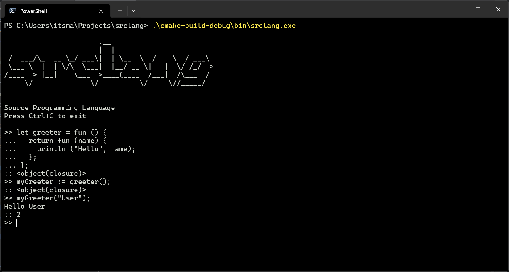

<!-- PROJECT LOGO -->
<br />
<div align="center">
  <a href="https://github.com/itsmanjeet/srclang">
    <h1>SrcLang</h1>
  </a>

<h3 align="center">Source Programming Language</h3>

  <p align="center">
    A Platform independent, Easy to Learn, Bytecode Programming Language.
    <br />
    <a href="https://github.com/itsmanjeet/srclang"><strong>Explore the docs »</strong></a>
    <br />
    <br />
    <a href="https://github.com/itsManjeet/srclang/releases/tag/continuous">View Demo</a>
    ·
    <a href="https://github.com/itsmanjeet/srclang/issues">Report Bug</a>
    ·
    <a href="https://github.com/itsmanjeet/srclang/issues">Request Feature</a>
  </p>
</div>


[](https://github.com/itsManjeet/srclang/actions/workflows/build-and-release.yml)

<!-- TABLE OF CONTENTS -->
<details>
  <summary>Table of Contents</summary>
  <ol>
    <li>
      <a href="#about-the-project">About The Project</a>
      <ul>
        <li><a href="#built-with">Built With</a></li>
      </ul>
    </li>
    <li>
      <a href="#getting-started">Getting Started</a>
      <ul>
        <li><a href="#prerequisites">Prerequisites</a></li>
        <li><a href="#installation">Installation</a></li>
      </ul>
    </li>
    <li><a href="#usage">Usage</a></li>
    <li><a href="#roadmap">Roadmap</a></li>
    <li><a href="#contributing">Contributing</a></li>
    <li><a href="#license">License</a></li>
    <li><a href="#contact">Contact</a></li>
    <li><a href="#acknowledgments">Acknowledgments</a></li>
  </ol>
</details>


<!-- ABOUT THE PROJECT -->

## About The Project

[](https://github.com/itsmanjeet/srclang)

SrcLang or Source Programming Language is an easy to learn, dynamically typed bytecode Programming Language for platform
Independent Application Development.

Here's why:

* Write once run everywhere
* Faster, efficient and lightweight
* Easy to learn, you can get use to it within a weekend.

<!-- GETTING STARTED -->

## Getting Started

SrcLang uses only system provided libraries and hence no special setup is required other than CMake and C++ Compiler to
build and run SrcLang.

<!-- USAGE EXAMPLES -->

## Usage

You can either compile the code from source or use the `continuous` release build
from [GitHub Release](https://github.com/itsManjeet/srclang/releases/tag/continuous)

## Basics

```
# Supported DataType

# Boolean
true false

# Number
10 10.02 10_00_000.0_10

# String
"Supported Multiline
String by Default"

# List
[10, true, "Hey", fun () { return 0; }, {a: 10, b: 20}];

# Map
{
  a: 10,
  b: "20",
  c: [20, 40]
}

# Closures
let adder = fun (p) {
  return fun (a, b) {
    return a + b + p;
  };
};
let p_adder = adder(2);

println (p_adder(20, 30));


# Error
error("This is a error");

# Type
let str_type = type("string");

# Nil
nil


# Variable declaration

let x = 10;

x := 10; # Declare variable of not already defined else reassign new value

# Condition

# Condition support multiple statements
if result := false; not result {
  println ("Not Result");
} else {
  println ("Result");
}

# Loops

for true {
  println ("infinite");
}

for a in [10, 20, 30, 40] {
  println (a);
}

for a in range(0, 10, 2) {
  println (a);
}

# Function

# Functions in srclang are First class Citizens
# and can be assigned as normal values

let adder = fun (pre) {
  return fun (a, b) {
    return a + b + pre;
  };
};

let th_adder = adder(10);
println (th_adder(20, 30));

# Error handling
if ok := someFun(10); not ok {
  println ("Error");
};

# Object Oriented

let Complex = fun (real, img) {
  self := { real: real, img: img};
  
  self.__type__ = fun () {
    return "<complex>;
  };
  
  self.__str__ = fun () {
    return str(self.real) + " i" + str(self.img);
  };
  
  self.Add = fun (other) {
    return Complex(self.real + other.real, self.img + other.img);
  };
};

let complex = Complex(10, 20);

println (complex);

# Resource Management via defer

if let file = open("hello.txt"); not file {
  ...
}
defer { file.Close(); };


# Builtins

# To get length of elements
len("Hello World");

# Append and Pop value in list
let arr = [10, 20];
arr = append(arr, 30);

arr = pop(arr);

# Range to generate a list of values
# range(end);
# range(start, end);
# range(start, end, inc);

let arr = range(10);
arr = range(2, 10);
arr = range(5, 10, 2);

# Lazy evaluate SrcLang code
let result = eval("range(10);");


# Safely call srclang function in sandbox
let result = call(adder, 10, 20);

# Open() to create and edit file

let file = open("hello.txt");
defer { file.Close() };
file.Write("Hello World");

# Exec() to execute system calls
let status = exec("dir", fun (out) {
  print(out);
});

# Socket to create socket

let sock = socket("tcp4");

sock.Bind("0.0.0.0:8000");

sock.File.Write("Hello World");


```

<!-- ROADMAP -->

## Roadmap

- [x] Basic Infrastructure and Working
- [x] Platform Independent Codebase
- [x] Nan Boxing
- [ ] Stabilize Codebase
- [ ] Support Bytecode dumping
- [ ] Platform Independent FFI support

See the [open issues](https://github.com/itsmanjeet/srclang/issues) for a full list of proposed features (
and known issues).


<!-- CONTRIBUTING -->

## Contributing

Contributions are what make the open source community such an amazing place to learn, inspire, and create. Any
contributions you make are **greatly appreciated**.

If you have a suggestion that would make this better, please fork the repo and create a pull request. You can also
simply open an issue with the tag "enhancement".
Don't forget to give the project a star! Thanks again!

1. Fork the Project
2. Create your Feature Branch (`git checkout -b feature/AmazingFeature`)
3. Commit your Changes (`git commit -m 'Add some AmazingFeature'`)
4. Push to the Branch (`git push origin feature/AmazingFeature`)
5. Open a Pull Request

<!-- LICENSE -->

## License

Distributed under the GPLv3 License. See `LICENSE` for more information.


<!-- CONTACT -->

## Contact

Manjeet Singh - itsmanjeet1998@gmail.com

Project Link: [https://github.com/itsmanjeet/srclang](https://github.com/itsmanjeet/srclang)
